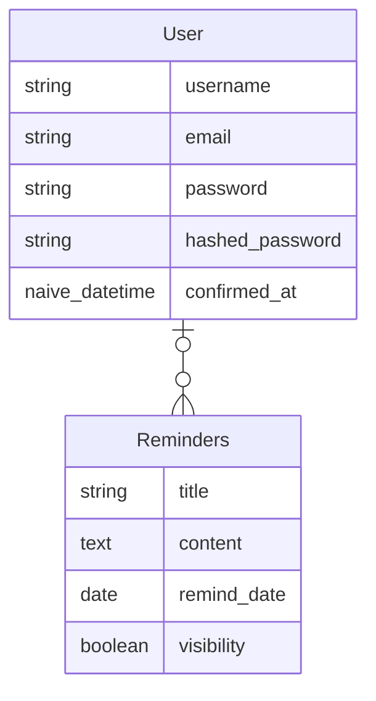

# RemindMe

To start your Phoenix server:

  * Run `mix setup` to install and setup dependencies
  * Start Phoenix endpoint with `mix phx.server` or inside IEx with `iex -S mix phx.server`

Now you can visit [`localhost:4000`](http://localhost:4000) from your browser.

Ready to run in production? Please [check our deployment guides](https://hexdocs.pm/phoenix/deployment.html).

## Learn more

  * Official website: https://www.phoenixframework.org/
  * Guides: https://hexdocs.pm/phoenix/overview.html
  * Docs: https://hexdocs.pm/phoenix
  * Forum: https://elixirforum.com/c/phoenix-forum
  * Source: https://github.com/phoenixframework/phoenix

